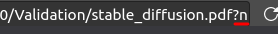

Firefox CSS theme to maximize the vertical space of your monitor.


(Background: [Tempano Port by Duwon Lee](https://www.artstation.com/artwork/dB84A))

## Contents
- [Contents](#contents)
- [Compatibilty](#compatibilty)
- [Features](#features)
- [Suggested Tweaks](#suggested-tweaks)
- [Toggle PDF reader dark mode](#toggle-pdf-reader-dark-mode)
- [Install](#install)
- [Credits](#credits)

## Compatibilty
Supported:
* Gnome, KDE, Hyprland, i3wm
* Windows 10, Windows 11

Not supported:
* Windows 8.1
Problem: [Missing Toolbar Icons](https://github.com/hakan-demirli/Firefox_Custom_CSS/issues/7)
*  MacOS Catalina 10.15.5 and Big Sur 11.6
Problem: [No toolbar!](https://github.com/hakan-demirli/Firefox_Custom_CSS/issues/3)

## Features
 * Horizontal tabs are removed. Use [Sidebery](https://addons.mozilla.org/en-US/firefox/addon/sidebery/) or [Tree Style Tab](https://addons.mozilla.org/en-US/firefox/addon/tree-style-tab/)
 * Dark mode for the default PDF reader:<br>
   

 * Dark mode for hover URL menu:<br>
 

 * Thinner scroll bars:<br>
 

## Suggested Tweaks
**Enable Compact Mode**<br>
_about:config > browser.compactmode.show > True_

**Startup Image**<br>
_about:config > browser.startup.preXulSkeletonUI > False_

**Save Startup Tabs**<br>
_Settings > General > Startup > Open previous windows and tabs > True_
(Otherwise size of the top sites will change everytime you open the browser.)

**Prevent Pinned Tabs From Loading**
_browser.sessionstore.restore_pinned_tabs_on_demand > True_

## Toggle PDF reader dark mode
The PDF viewer dark mode is active by default. To deactivate it, just add ```?n``` to the end of your pdf URL.<br>


## Install
* Follow the steps below to open the necessary directory:
  * Application Menu > Help > More troubleshooting information > Profile Folder > Open Folder
* Create a new folder and name it `chrome`
* Copy all of the files into the `chrome` folder
* Enable user scripts and compact mode:
  * Go to the `about:config` URL
  * Set `toolkit.legacyUserProfileCustomizations.stylesheets` to true
  * Set `browser.compactmode.show` to true
  * Right click Toolbar > Customize Toolbar > Density (Bottom Left) > Compact
* Install vertical tab extension: [Sidebery](https://addons.mozilla.org/en-US/firefox/addon/sidebery/) or [Tree Style Tab](https://addons.mozilla.org/en-US/firefox/addon/tree-style-tab/)
* Reopen Firefox
* Customize the Sidebery/TreeStyleTabs and Toolbar to your hearts content.
## Credits
  * [r/FirefoxCSS](https://www.reddit.com/r/FirefoxCSS/)
